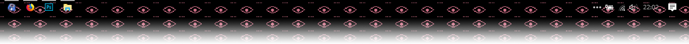
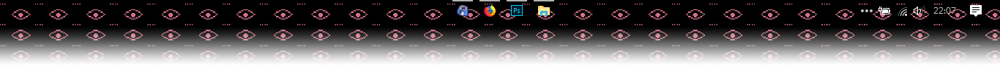

# Sajtkukac
C++ tool for Windows to make your taskbar icons stay in the center.

#### Before

#### After

## Usage
After opening the exe, it will show up in your system tray.  
Right clicking will bring up a menu with the following options:
 * `Settings`: here you may configure how the icons should be placed, how often
 should the software refresh the position of the icons and what kind of easing
 algorithm should be used.
 * `Reload`: reloads the worker, in case anything may happen that makes it stop
 working.
 * `Check for updates`: allows the user to manually check for a new update and
 then apply it automatically.
 * `About`: shows the about dialog.
 * `Exit`: reloads Explorer to reset the UI and terminatesthe software.

The software download includes `Sajtkukac_example.ini` that contains information
about the possible settings and the meaning of their values.  
You may rename this included example configuration to `Sajtkukac.ini` or if not
present the software will create it automatically.

### Autostart
The easiest way of making this software start automatically when you log in is
by creating a shortcut for the software and placing the shortcut in the
`%APPDATA%\Microsoft\Windows\Start Menu\Programs\Startup\` folder.

## Contribution
Ideas, translations, design changes, code cleaning or real heavy code changes
are all welcome.  
This is my first C++ **and** WinApi project, so help is appreciated.

## Donation
If you feel like I could make your desktop look just a little bit cooler, you
are more than welcome to buy me a drink. :)

<table>
  <tr>
    <td></td>
    <td></td>
    <td><samp>19A72R4axsojj9UJRnpNWPd8bFLTce73v9</samp></td>
  </tr>
  <tr>
    <td></td>
    <td></td>
    <td></td>
  </tr>
</table>

## License
  

Sajtkukac is Free Software: You can use, study share and improve it at your
will. Specifically you can redistribute and/or modify it under the terms of the
[GNU General Public License](https://www.gnu.org/licenses/gpl.html) as
published by the Free Software Foundation, either version 3 of the License, or
(at your option) any later version.

### [simple_match](//github.com/jbandela/simple_match/)
By John R. Bandela, licensed under Boost Software License - Version 1.0

### Ease Out Back algorithm
By Robert Penner, licensed under the BSD 2-clause license
